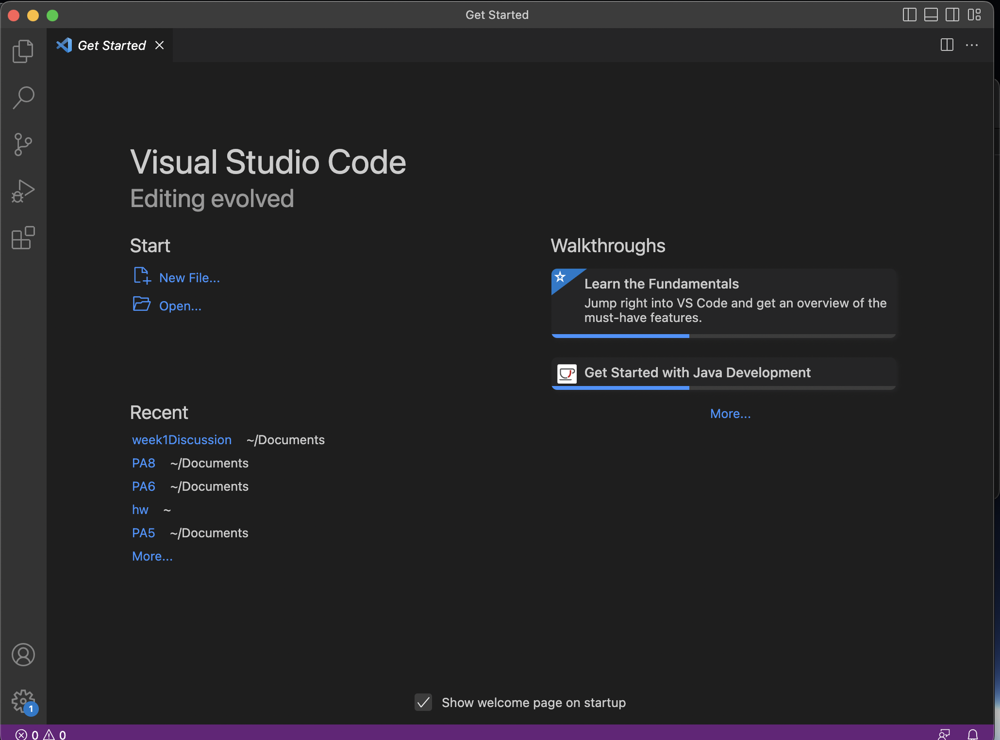
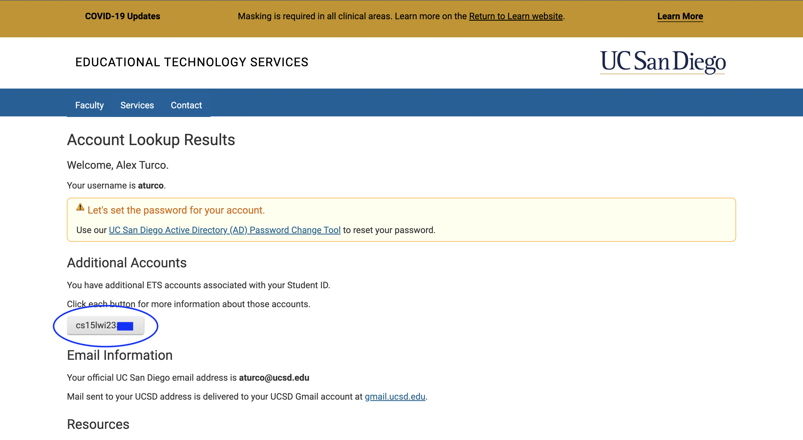
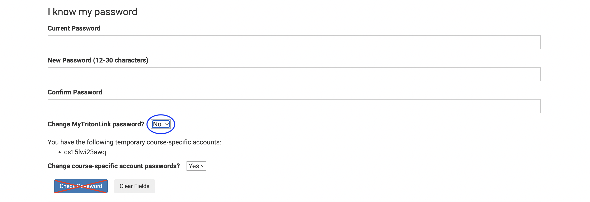
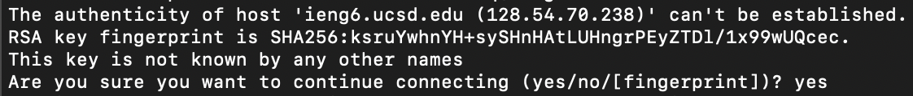
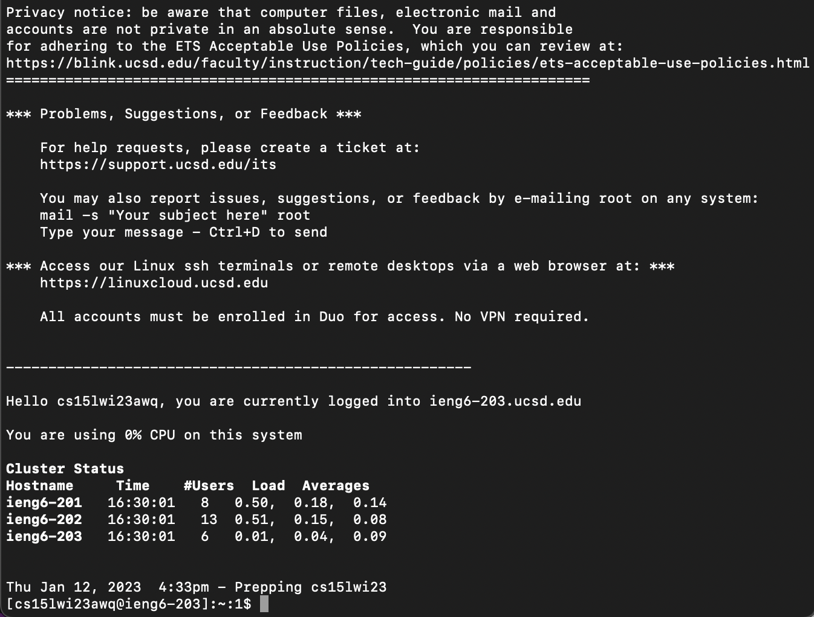
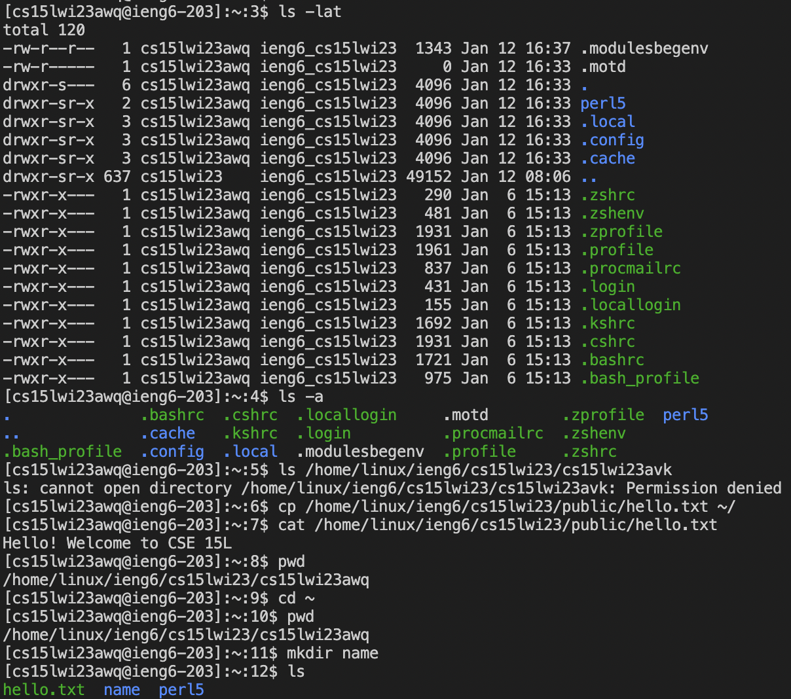
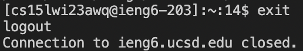

# CSE 15L Week 1 Lab Report
## Alex Turco
* Step 1 : Install VS Code

Visit the link [Link](https://code.visualstudio.com/) to install VS code to your computer. 
On the website there will be specific instructions on how to complete the download and installation to your specific type of device. 
Personally, I was able to skip this step as I had previously downloaded this application for CSE 11 last quarter.

-----------------------------------------------------------------------------------------------------------------------------------------------------------

* Step 2 : Find your course-specific username

Visit the link [Link](https://sdacs.ucsd.edu/~icc/index.php) to find your course-specific username.
When prompted, enter in your UCSD username and PID. 
Then, locate your username beginning with cs15l.

If you are accessing this account for the first time, like me, then you will have to reset your password.
To do this, click on your cs15l account and click the global password reset link.
Enter your current UCSD password, your new password for that account, and check off no for changing MyTritonLink password.
Then simply press enter on your keyboard, DO NOT press check password.

Wait at least 15 minutes before moving onto the next step.

-----------------------------------------------------------------------------------------------------------------------------------------------------------

* Step 3 : Log-in to the remote server

Using windows requires some first steps.
Install git, Git for Windows, then follow steps to make git bash your default server, Using Bash on Windows in VScode.
I did not have to do this as I am using a mac.
Now, open a terminal in VS code.
you will then type the command 'ssh YOUR_ACCOUNT@ieng6.ucsd.edu' into the terminal, with your specific account in front of @ieng6.ucsd.edu.
If this is your first time logging in, you will probably get a message that looks like this. 
Type "yes" and enter your password (you will not be able to see what you are typing and that is OK).
You should then get a message that looks like this.  This means you are connected to a CSE building computer.

-----------------------------------------------------------------------------------------------------------------------------------------------------------

* Step 4 : Run some test commands

Finally, test out some commands.
Use commands like:
* 'cd ~'
* 'cd'
* 'ls -lat'
* 'ls -a'
* 'ls /home/linux/ieng6/cs15lwi23/"another students username"'
* 'cp /home/linux/ieng6/cs15lwi23/public/hello.txt ~/'
* 'cat /home/linux/ieng6/cs15lwi23/public/hello.txt'

You should get back some results that look along the lines of 

-----------------------------------------------------------------------------------------------------------------------------------------------------------

* Step 5 : Log-out

To log-out of the remote server you can use "ctrl-D" or type the command "exit" and get something that looks like this. 
