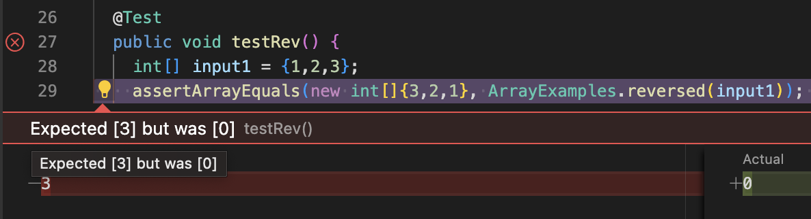
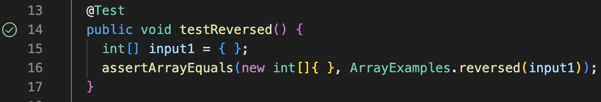

# CSE 15L Week 3 Lab Report
## Alex Turco

---

__My Code for String Server:__
```
import java.io.IOException;
import java.net.URI;

class Handler implements URLHandler {
    String output = "";

    public String handleRequest(URI url) {
        if (url.getPath().equals("/add-message")) {
            String[] parameters = url.getQuery().split("=");
            output += parameters[1] + "\n";
        }
        return output;
    }
}

public class StringServer {
    public static void main(String[] args) throws IOException {
        int port = Integer.parseInt(args[0]);

        Server.start(port, new Handler());
    }
}
```

---

__Input 1:__


Methods Called:

* `handleRequest(URI url)`

The argument that is passed to this method is `http://localhost:4000/add-message?s=hello`

The value of `output` changes from an empty String to "hello" + "/n"

---

__Input 2:__


Methods Called:

* `handleRequest(URI url)`

The argument that is passed to this method is `http://localhost:4000/add-message?s=does this work?`

The value of `output` changes from "hello" to "hello" + "/n" + "does this work?" + "/n"

---
__The Reversed Method:__

```
int[] input1 = {1,2,3};
assertArrayEquals(new int[]{3,2,1}, ArrayExamples.reversed(input1));
```


```
int[] input1 = { };
assertArrayEquals(new int[]{ }, ArrayExamples.reversed(input1));
```


Flawed Code:

```
static int[] reversed(int[] arr) {
    int[] newArray = new int[arr.length];
    for(int i = 0; i < arr.length; i += 1) {
      arr[i] = newArray[arr.length - i - 1];
    }
    return arr;
  }
```

Improved Code:

```
static int[] reversed(int[] arr) {
    int[] newArray = new int[arr.length];
    for(int i = 0; i < arr.length; i += 1) {
      newArray[i] = arr[arr.length - i - 1];
    }
    return newArray;
  }
```

Bugs:

* The reversed method did not return `newArray`, it returned `arr`.
* The reversed method did not copy the elements of `arr` to `newArray`, it did the opposite.

Switching the return value to `newArray` and the assignment to `newArray[i] = arr[arr.length - i - 1];` allows for the new reversed array to obtain the elements of `arr` in reversed order and be returned.

---

What I learned from these labs was how servers could be created in visual studio code and then accesed either through the local computer or even through remote access. It was very interesting to me when I was able to access a partners server by changing parts of the url and how I could share my own. I also enjoyed learning how to test for bugs as this is something that has come in handy for my CSE 12 class.
