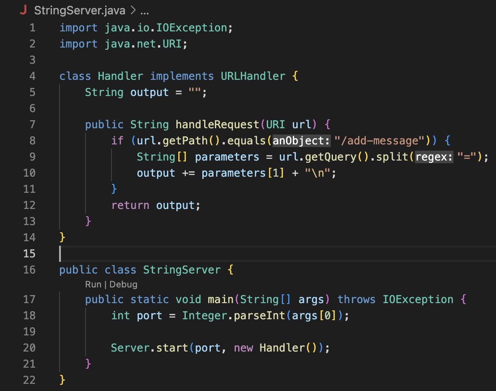

My Code for String Server:

Input 1:

Methods Called:

* `handleRequest(URI url)`

The argument that is passed to this method is `http://localhost:4000/add-message?s=hello`

The value of `output` changes from an empty String to "hello" + "/n"

Input 2:

Methods Called:

* `handleRequest(URI url)`

The argument that is passed to this method is `http://localhost:4000/add-message?s=does this work?`

The value of `output` changes from "hello" to "hello" + "/n" + "does this work?" + "/n"
