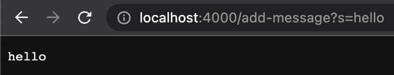
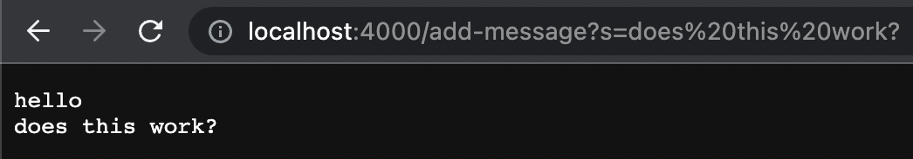

My Code for String Server:
```
import java.io.IOException;
import java.net.URI;

class Handler implements URLHandler {
    String output = "";

    public String handleRequest(URI url) {
        if (url.getPath().equals("/add-message")) {
            String[] parameters = url.getQuery().split("=");
            output += parameters[1] + "\n";
        }
        return output;
    }
}

public class StringServer {
    public static void main(String[] args) throws IOException {
        int port = Integer.parseInt(args[0]);

        Server.start(port, new Handler());
    }
}
```

---

Input 1:



Methods Called:

* `handleRequest(URI url)`

The argument that is passed to this method is `http://localhost:4000/add-message?s=hello`

The value of `output` changes from an empty String to "hello" + "/n"

---

Input 2:



Methods Called:

* `handleRequest(URI url)`

The argument that is passed to this method is `http://localhost:4000/add-message?s=does this work?`

The value of `output` changes from "hello" to "hello" + "/n" + "does this work?" + "/n"

---

```
int[] input1 = {1,2,3};
assertArrayEquals(new int[]{3,2,1}, ArrayExamples.reversed(input1));
```

```
int[] input1 = { };
assertArrayEquals(new int[]{ }, ArrayExamples.reversed(input1));
```
old code
```
static int[] reversed(int[] arr) {
    int[] newArray = new int[arr.length];
    for(int i = 0; i < arr.length; i += 1) {
      arr[i] = newArray[arr.length - i - 1];
    }
    return arr;
  }
```

better code
```
static int[] reversed(int[] arr) {
    int[] newArray = new int[arr.length];
    int j = 0;
    for(int i = arr.length - 1; i >= 0; i--) {
      newArray[j] = arr[i];
      j++;
    }
    return newArray;
  }
```
