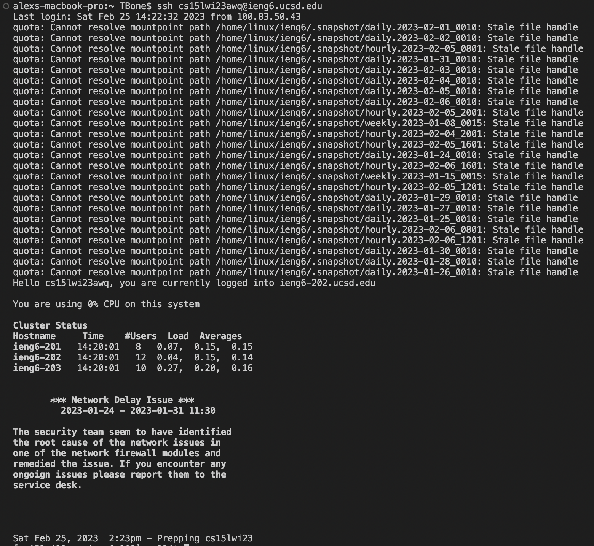
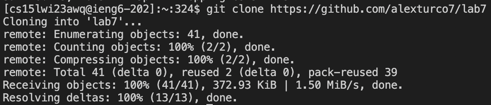
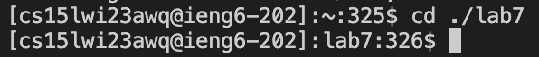
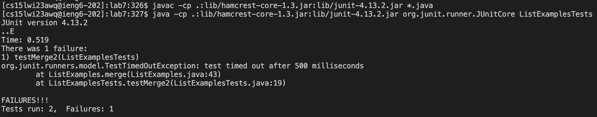
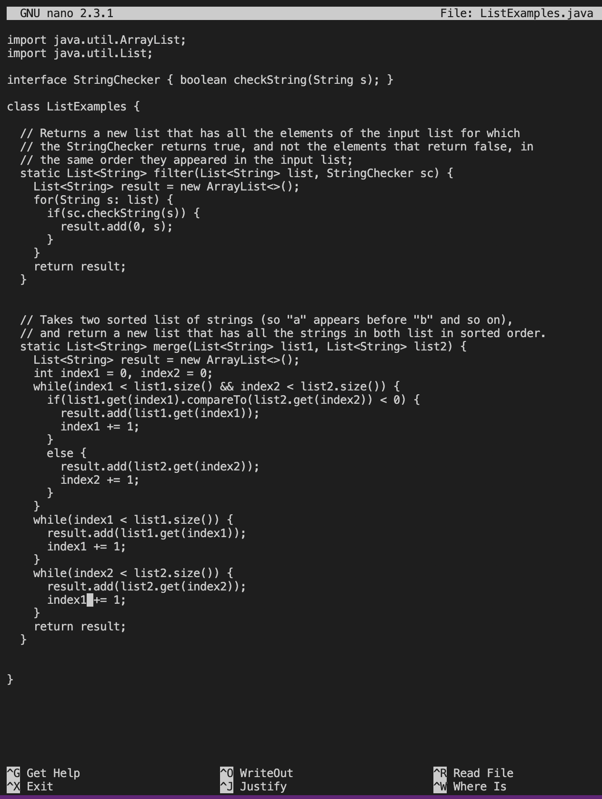
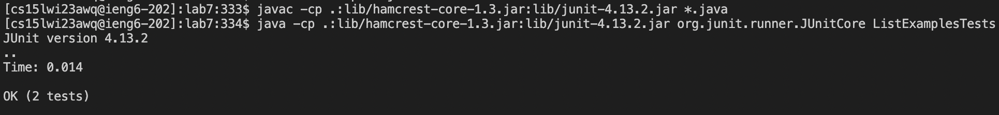
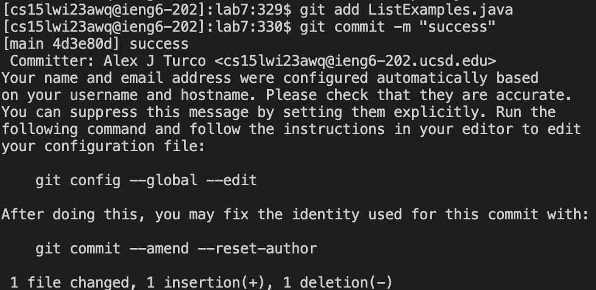
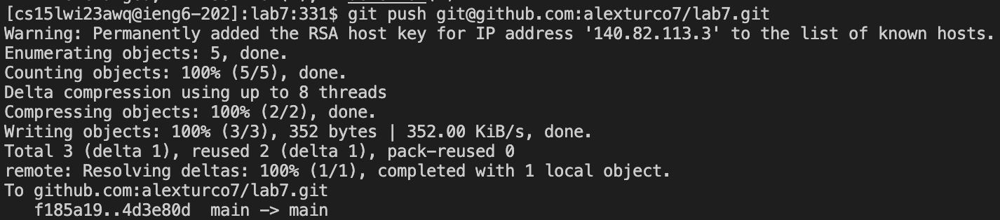

# CSE 15L Week 7 Lab Report
## Alex Turco

---

To start, I pressed the `<up>` arrow 5 times to access the command `ssh cs15lwi23awq@ieng6.ucsd.edu` in my search histoy and pressed `<enter>` to log into my remote server. 

Then, I pressed the `<up>` arrow 10 more times to access the command `git clone https://github.com/alexturco7/lab7` in my search history and pressed `<enter>` to clone the repository into my remote server. 

Next, I typed `cd ./lab7` into the command line and pressed `<enter>` to change into the new cloned directory "lab7". 

I then remembered the commands to compile and run the tests were in search history farther back, so I pressed the `<up>` arrow 17 times to access the command to compile, `javac -cp .:lib/hamcrest-core-1.3.jar:lib/junit-4.13.2.jar *.java`, pressed `<enter>`, and then pressed `<up>` another 17 times to access the command to run, `java -cp .:lib/hamcrest-core-1.3.jar:lib/junit-4.13.2.jar org.junit.runner.JUnitCore ListExamplesTests`, and pressed `<enter>` again. 

To edit the faulty file, I typed `nano ListExamples.java` into the command line and pressed `<enter>` to access nano, which allowed me to look at and edit the file. 

After finding the bug, I pressed the `<down>` arrow 42 times, the `<right>` arrow 12 times, `<backspace>` once, and then Typed `2`.

After that, I pressed `ctrl o` `<enter>` and then `ctrl x` to save, confirm, and exit nano respectfully.

I then pressed the `<up>` arrow 3 times to access the compile command `javac -cp .:lib/hamcrest-core-1.3.jar:lib/junit-4.13.2.jar *.java` again, pressed `<enter>`, and then 3 more times to run the tests using `java -cp .:lib/hamcrest-core-1.3.jar:lib/junit-4.13.2.jar org.junit.runner.JUnitCore ListExamplesTests` and `<enter>`. 

I then added the newly changed file by typing `git add ListExamples.java` and pressing `<enter>`.

To commit the changes to the directory I typed `git commit -m "success"` and pressed `<enter>`. 

Finally, to push the directory to my GitHub account I pressed the `<up>` arrow 20 times to access the command `git push git@github.com:alexturco7/lab7.git` from my search history and pressed `<enter>` to push it. 
